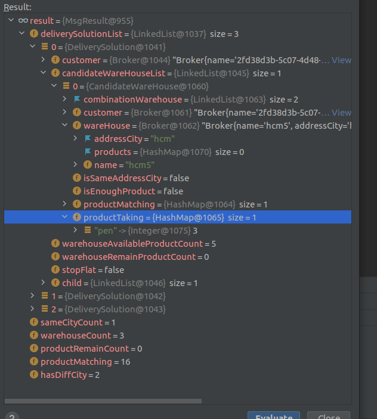

### Documentation
> I have done my home test and i'm writing this to give you the explanation for easy to observe the result.  
>
> I wrote some Unit tests with simple scenarios(src/test/java/WarehouseTest.java), to validate you can clone them.

> The image below is the result object with some basic information of a solution.
>
> For example, warehouseCount is the number of warehouses in a combination,
> the information for each warehouse is deliverySolutionList.candidateWareHouseList.warehouse inside list deliverySolutionList .
> 

